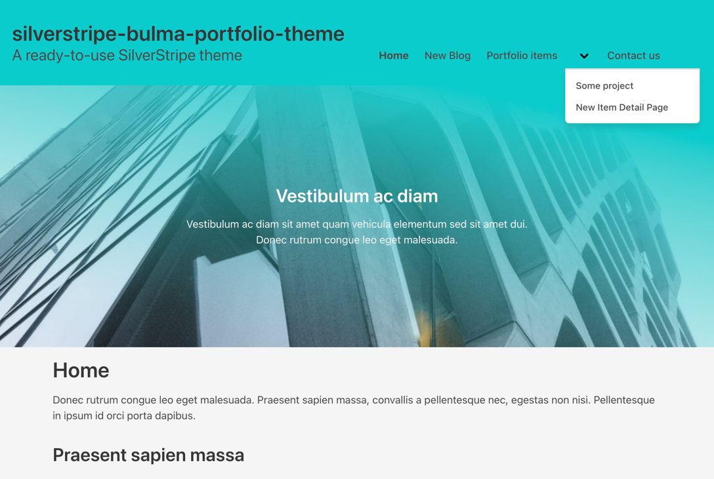
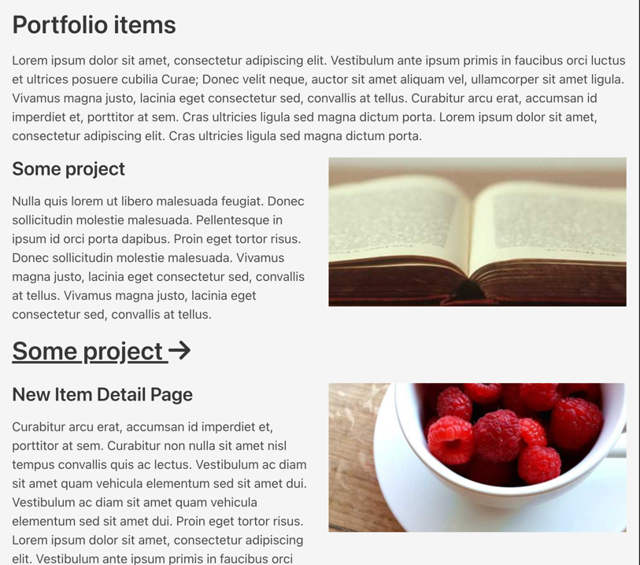

# Silverstripe Bulma Portfolio Theme
A nice, ready-to-use, responsive [Bulma](https://bulma.io/)-based theme. Ready to start for example your portfolio website!

Extendable with `robertvanlienden/silverstripe-addons` (and more themes), but also usable as stand-alone theme.

## Screenshot




## Requirements
### Installation
- Silverstripe 4

### Extendable with the following silverstripe modules
* `robertvanlienden/silverstripe-addons`
This module adds features like items pages, footer HTML and header logo upload.
* `dnadesign/silverstripe-elemental`
* `wedevelopnl/silverstripe-elemental-grid`
* `silverstripe/userforms`
* `silverstripe/blog`
* `silverstripe/comments`

## Installation
* Copy the theme into the `themes` directory
* `app/_config/theme.yml` update to the following;\
```yaml
---
Name: mytheme
---
SilverStripe\View\SSViewer:
  themes:
    - '$public'
    - 'silverstripe-bulma-portfolio-theme'
    - '$default'
```
* Run `composer vendor-expose`
* Run a `dev/build flush=all` and you should be ready to go!

### Development
- Node Package Manager (npm)
- Node Version Manager (nvm)

## Developing
This theme is easy to customize and make your own! To make changes in CSS/JS you need to do the following;

I suggest to just use Node Version Manager to use the right Node version.
Just run `nvm use` in the theme folder, and run an `npm install`.

You're ready to start developing on this theme!

### Build
Want to build JS/CSS assets for production? Just run;
`npm run build` and let webpack compile the production assets.

### Watch
Watch for changes by running `npm run build`

## License
This theme is published under MIT License.

If you use this theme commercial and make money with this theme, please be kind and do a donation (see Donations below).

## Issue/PR
Feel free to make some issue/PR if you find issues/bugs/improvements.

If you want to make big changes, please first create an issue to discuss this change with the maintainer.
I don't want you to spend lots of time to create amazing thing that not getting merged into this repo.

## Donations
Do you want to thank me for making this SilverStripe theme?

Please donate to me with PayPal! You can donate on [Paypal.me/robertvanlienden](http://paypal.me/robertvanlienden).
